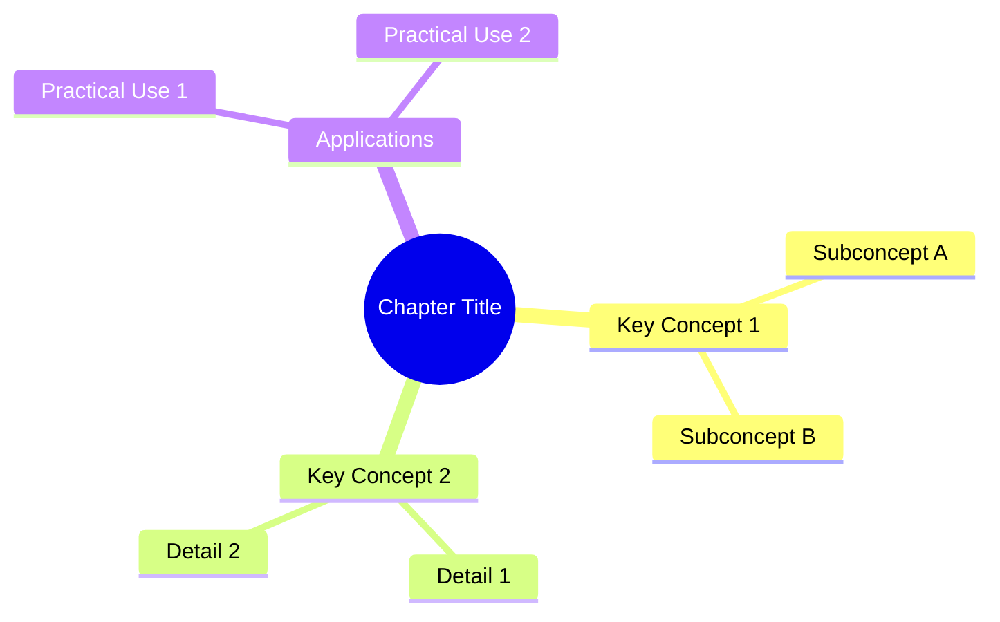

# Mind Map & Chapter Summary Generation System

## Overview

This system processes text content (from EPUB files or other sources) and generates comprehensive mind maps and chapter summaries using AI models. The system follows a structured workflow that analyzes content, creates visual mind maps, and produces professional documentation.

## 🏗️ System Architecture

```
Input Text → Content Analysis → Mind Map Generation → Summary Creation → DOCX Export
     ↓              ↓                   ↓                    ↓            ↓
  Raw Text    Knowledge Extract    Mermaid Diagrams    Structured Notes  Professional Docs
```

### Core Components

1. **Content Extractor** (`mindmap_core/extractor.py`) - Analyzes and extracts knowledge
2. **Mind Map Generator** (`mindmap_core/mindmap_generator.py`) - Creates visual diagrams
3. **Notes Generator** (`mindmap_core/notes_generator.py`) - Produces explanatory content
4. **Synthesizer** (`mindmap_core/synthesizer.py`) - Combines all analysis
5. **DOCX Creator** (`simple_docx_creator.py`) - Exports professional documents

## 🧠 Mind Map Generation Process

### Step 1: Content Analysis

The system uses a **CAPTURE Framework** for comprehensive analysis:

- **C**ontext Understanding
- **A**ction Items Identification  
- **P**atterns Recognition
- **T**hemes Extraction
- **U**tility Assessment
- **R**elationships Mapping
- **E**ssential Insights

```python
# In mindmap_core/extractor.py
def extract_knowledge(self, content, title="Chapter"):
    """
    Extracts structured knowledge using CAPTURE framework
    Returns: Dict with themes, patterns, insights, etc.
    """
```

### Step 2: Mind Map Structure Creation

The system generates **Mermaid syntax** mind maps with multiple complexity levels:

#### Mind Map Types:
1. **Simple Mind Map** - Basic structure with main concepts
2. **Comprehensive Mind Map** - Detailed with relationships and subcategories
3. **Actionable Mind Map** - Focus on practical applications and next steps

```python
# In mindmap_core/mindmap_generator.py
def create_comprehensive_mindmap(self, analysis_data, title):
    """
    Creates detailed Mermaid mind map from analysis
    Returns: Mermaid syntax string
    """
```

#### Mermaid Syntax Example:


### Step 3: Visual Generation

Mind maps are converted to images using the **Mermaid.ink API**:

```python
# In simple_docx_creator.py
def _generate_mindmap_image(mermaid_content):
    """
    Converts Mermaid syntax to PNG image
    Returns: Binary image data
    """
    url = "https://mermaid.ink/img/"
    encoded = base64.b64encode(mermaid_content.encode()).decode()
    response = requests.get(f"{url}{encoded}")
```

## 📝 Chapter Summary Generation

### Summary Types Generated:

1. **Quick Summary** - Concise overview with key points
2. **Mind Map Explanation** - Detailed explanation of the mind map structure
3. **Analysis Summary** - Comprehensive analysis using CAPTURE framework

### Summary Generation Process:

```python
# In mindmap_core/notes_generator.py
def create_notes(self, analysis_data, mindmap_content=None):
    """
    Generates comprehensive notes and explanations
    Combines analysis data with mind map context
    """
```

#### Content Structure:
- **Executive Summary** - High-level overview
- **Key Insights** - Important discoveries and patterns
- **Detailed Analysis** - Section-by-section breakdown
- **Practical Applications** - How to use the information
- **Connections** - Relationships between concepts

## 🔄 Complete Workflow

### 1. Input Processing
```python
# In app.py - processing workflow
def _process_mindmaps_worker(self, session_id, selected_chapters, chapter_contents, ai_model, api_key):
    for chapter_file in selected_chapters:
        content = chapter_contents[chapter_file]
        
        # Process through MindMapCreator
        results = creator.process_chapter(content, title=chapter_name)
```

### 2. Analysis Pipeline
```python
# In mindmap_core/__init__.py
def process_chapter(self, content, title="Chapter"):
    # Step 1: Extract knowledge
    analysis = self.extractor.extract_knowledge(content, title)
    
    # Step 2: Create mind map
    mindmap = self.mindmap_generator.create_comprehensive_mindmap(analysis, title)
    
    # Step 3: Generate notes
    notes = self.notes_generator.create_notes(analysis, mindmap)
    
    # Step 4: Synthesize results
    summary = self.synthesizer.create_comprehensive_summary(analysis)
```

### 3. Output Generation
```python
# In simple_docx_creator.py
def create_docx(chapters, output_path=None):
    # Creates professional DOCX with:
    # - Formatted titles
    # - Mind map images
    # - Structured summaries
    # - Clean formatting (no markdown remnants)
```

## 🎛️ Customization Points

### 1. AI Model Configuration
```python
# In mindmap_core/config.py
AI_MODELS = {
    'gpt-4o-mini': {'cost_per_1k_tokens': 0.0015},
    'gpt-4o': {'cost_per_1k_tokens': 0.03},
    # Add custom models here
}
```

### 2. Mind Map Styles
Modify the Mermaid generation in `mindmap_generator.py`:
```python
def _format_mindmap_node(self, text, level=0):
    # Customize node formatting
    # Change shapes: (()), [], {}, ()
    # Modify colors and styles
```

### 3. Summary Templates
Customize summary generation in `notes_generator.py`:
```python
def _create_summary_prompt(self, analysis_data):
    # Modify the AI prompt template
    # Change summary structure and focus areas
```

### 4. Document Formatting
Modify DOCX styling in `simple_docx_creator.py`:
```python
def _setup_styles(doc):
    # Customize fonts, sizes, spacing
    # Modify professional formatting
```

## 📁 File Structure & Key Files

```
mindmap_core/
├── __init__.py           # Main MindMapCreator class
├── extractor.py          # CAPTURE framework analysis
├── mindmap_generator.py  # Mermaid diagram creation
├── notes_generator.py    # Summary and explanation generation
├── synthesizer.py        # Result combination and synthesis
├── config.py            # AI models and pricing
├── utils.py             # Helper functions
└── web_config.py        # Web-specific configurations

simple_docx_creator.py    # Professional document generation
app.py                   # Main Flask application
epub_processor/          # EPUB file processing
├── __init__.py
└── epub_extractor.py
```

## 🔧 Key Implementation Details

### 1. Memory-Only Processing
- All processing happens in RAM
- No temporary files written to disk
- API keys never stored persistently
- Downloads generated on-demand

### 2. Professional Title Formatting
```python
def _format_chapter_title(chapter_name, chapter_data=None):
    # Converts: "07_chapter_chapter-2-how-to-almost-make-anything"
    # To: "Chapter 2: How To Almost Make Anything"
```

### 3. Markdown Cleaning
```python
def _clean_markdown_remnants(content):
    # Removes: **, ---, __, ~~text~~, `code`
    # Ensures clean professional output
```

### 4. Error Handling
- Graceful fallbacks for API failures
- Text alternatives when image generation fails
- Comprehensive logging for debugging

## 🚀 Getting Started

### 1. Basic Usage
```python
from mindmap_core import MindMapCreator

creator = MindMapCreator(model='gpt-4o-mini', api_key='your-key')
results = creator.process_chapter(content, title="Your Chapter")
```

### 2. Customizing Analysis
```python
# Modify the CAPTURE framework prompts in extractor.py
# Adjust mind map complexity in mindmap_generator.py
# Change summary structure in notes_generator.py
```

### 3. Adding New Output Formats
```python
# Create new functions in simple_docx_creator.py
# Add export options in app.py
# Modify templates in templates/
```

## 🎯 Best Practices

1. **Content Length**: Works best with 1000-5000 word chapters
2. **API Keys**: Always pass keys as parameters, never store persistently
3. **Error Handling**: Check for None returns and handle gracefully
4. **Performance**: Use gpt-4o-mini for faster, cheaper processing
5. **Customization**: Modify prompts gradually and test thoroughly

## 🐛 Troubleshooting

### Common Issues:
1. **Mermaid Syntax Errors**: Check `_validate_mindmap_syntax()` in simple_docx_creator.py
2. **API Rate Limits**: Implement delays between requests
3. **Memory Issues**: Process large files in smaller chunks
4. **Title Formatting**: Verify chapter name patterns in `_format_chapter_title()`

### Debug Mode:
Enable verbose logging by modifying print statements in the processing workflow.

---

*This system represents a complete pipeline from raw text to professional mind map documentation, designed for flexibility and customization while maintaining professional output quality.*