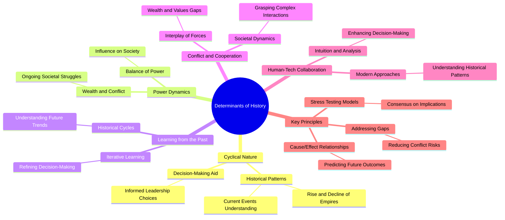
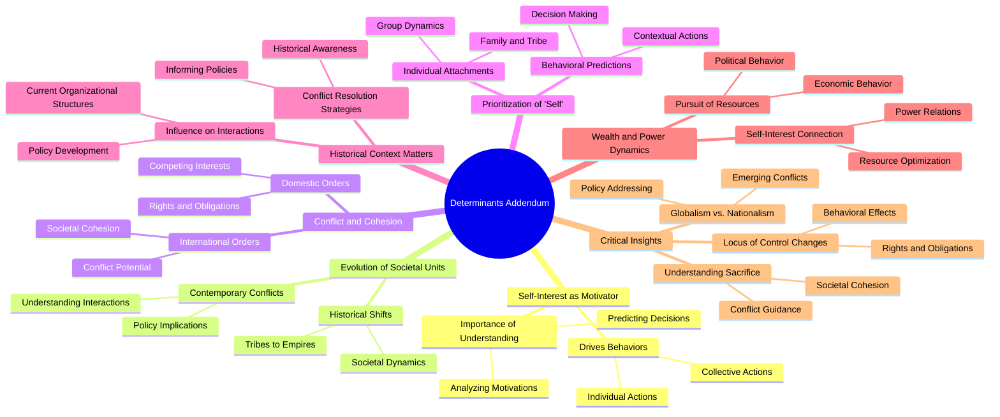

# Complete Mindmap Analysis Results

Generated on: 2025-07-27 17:46:53

---

## 04 Chapter Chapter 2 The Determinants

### Mindmap


```

### Summary

# Analysis Summary: 04_chapter_chapter-2-the-determinants

## Main Themes

1. {'theme': 'Cyclical Nature of History', 'importance': 5, 'rationale': 'The chapter emphasizes the repetitive patterns in history, particularly the rise and decline of empires, which is crucial for understanding current events.'}
2. {'theme': 'Power Dynamics', 'importance': 5, 'rationale': 'The balance of power and its influence on wealth and conflict is a central theme, highlighting the ongoing struggles at various societal levels.'}
3. {'theme': 'Learning from the Past', 'importance': 4, 'rationale': 'The iterative process of learning from historical events is vital for refining decision-making and understanding future trends.'}
4. {'theme': 'Conflict and Cooperation', 'importance': 4, 'rationale': 'The interplay between conflict and cooperation, driven by wealth and values gaps, is essential for grasping societal dynamics.'}
5. {'theme': 'Human and Technological Collaboration', 'importance': 3, 'rationale': 'The integration of human intuition with computer analysis offers a modern approach to understanding complex historical patterns.'}

## Key Principles

1. {'principle': 'Understanding Cause/Effect Relationships', 'importance': 5, 'rationale': 'Recognizing timeless principles helps predict future outcomes based on historical patterns.'}
2. {'principle': 'Iterative Learning Process', 'importance': 5, 'rationale': 'Learning from past experiences is crucial for refining one’s understanding of historical cycles.'}
3. {'principle': 'Collaboration of Intuition and Analysis', 'importance': 4, 'rationale': 'Combining human insight with technological tools enhances decision-making in complex scenarios.'}
4. {'principle': 'Stress Testing Models', 'importance': 4, 'rationale': 'Debating and stress testing historical models leads to a better consensus on their implications.'}
5. {'principle': 'Studying Analogous Events', 'importance': 3, 'rationale': 'Examining similar historical occurrences clarifies underlying causes and effects.'}
6. {'principle': 'Addressing Wealth and Values Gaps', 'importance': 4, 'rationale': 'Mitigating these gaps is essential for reducing conflict, especially during economic downturns.'}

## Critical Insights

1. {'insight': 'Historical Cycles Aid Decision-Making', 'importance': 5, 'rationale': 'Understanding where a society stands in historical cycles can guide leaders in making informed choices.'}
2. {'insight': 'Predicting Trends through Cause/Effect', 'importance': 5, 'rationale': 'Timeless relationships can be leveraged to anticipate future behaviors in global contexts.'}
3. {'insight': 'Cultural Contexts Matter', 'importance': 4, 'rationale': 'Strategies must adapt to cultural and economic conditions to effectively manage power dynamics.'}
4. {'insight': 'Economic Conditions Drive Conflict', 'importance': 4, 'rationale': 'Addressing economic disparities is crucial for maintaining societal peace and stability.'}
5. {'insight': 'Class Dynamics Shape Society', 'importance': 4, 'rationale': 'Understanding class struggles is key to addressing societal relationships and conflicts.'}

## Actionable Takeaways

1. {'action': 'Study Historical Patterns', 'importance': 5, 'rationale': 'Engaging with historical cycles can provide insights for current decision-making.'}
2. {'action': 'Implement Stress Testing', 'importance': 4, 'rationale': 'Regularly stress test models to ensure they hold under various scenarios and assumptions.'}
3. {'action': 'Foster Collaboration', 'importance': 4, 'rationale': 'Encourage collaboration between human intuition and technological analysis in decision-making.'}
4. {'action': 'Address Economic Disparities', 'importance': 4, 'rationale': 'Proactively work to reduce wealth and values gaps to mitigate potential conflicts.'}
5. {'action': 'Engage in Continuous Learning', 'importance': 5, 'rationale': 'Adopt an iterative approach to learning from past experiences to refine understanding.'}


### Explanation

# Mind Map Explanation: 04_chapter_chapter-2-the-determinants

---

# Mind Map Explanation: Determinants of History

## Overview
This chapter explores the various factors that shape historical events and trends. By understanding the determinants of history, we can better comprehend the rise and fall of societies, the dynamics of power, and the lessons learned from past experiences. The insights gained can help us navigate current events and make informed decisions for the future.

## Key Themes Explained

### Cyclical Nature of History
The cyclical nature of history refers to the repetitive patterns that emerge over time, particularly the rise and decline of empires. For example, the Roman Empire experienced a significant rise in power, followed by a gradual decline. By studying these cycles, we can better understand current events, such as the rise of new global powers or the decline of established ones. This theme emphasizes that history is not linear but rather a series of cycles that can inform our understanding of present-day situations.

### Power Dynamics
Power dynamics play a crucial role in shaping history, particularly through the lens of wealth and conflict. Societies often struggle with issues related to wealth distribution, leading to conflicts that can alter the course of history. For instance, the American Civil War was largely driven by economic disparities and differing values between the North and South. Understanding these power dynamics helps us recognize the ongoing societal struggles and the importance of balance in power relations.

### Learning from the Past
Learning from the past is an iterative process that allows societies to refine their decision-making. By analyzing historical events, leaders can identify what worked and what didn’t, leading to better choices in the future. For example, the lessons learned from the Great Depression have influenced economic policies worldwide. This theme underscores the importance of historical awareness in shaping future trends and decisions.

### Conflict and Cooperation
The interplay between conflict and cooperation is essential for understanding societal dynamics. Wealth and values gaps often create tensions, but they can also lead to collaboration when societies work together to address common challenges. A contemporary example is the global response to climate change, where nations must balance their interests while cooperating for a sustainable future. This theme highlights the complexity of human interactions and the necessity of navigating both conflict and cooperation.

### Human-Tech Collaboration
In today’s world, the collaboration between human intuition and technological analysis is increasingly important. By leveraging technology, we can enhance our understanding of historical patterns and make more informed decisions. For instance, data analysis tools can help historians identify trends and predict future behaviors based on past events. This theme emphasizes the value of integrating human insight with modern technology for a deeper understanding of history.

## Practical Applications
Students can apply these insights in various ways, such as:
- Analyzing current events through the lens of historical cycles to predict potential outcomes.
- Understanding the importance of power dynamics in social issues, which can inform their perspectives on political debates.
- Using lessons from history to guide their decision-making in personal and academic contexts.

## Key Takeaways
- History often follows cyclical patterns, which can help us understand current events.
- Power dynamics, particularly related to wealth and conflict, significantly influence societal changes.
- Learning from past experiences is crucial for refining future decision-making.
- The interplay of conflict and cooperation shapes societal dynamics and requires careful navigation.
- Human intuition combined with technological analysis enhances our understanding of history and informs better decision-making.

---


---

## 05 Appendix Determinants Addendum

### Mindmap


```

### Summary

# Analysis Summary: 05_appendix_determinants-addendum

## Main Themes

1. Self-interest drives behaviors at various societal levels, influencing individual and collective actions.
2. The historical shifts in the primary units of optimization (tribes, states, empires) affect societal dynamics and conflicts.
3. Changes in domestic and international orders can lead to conflicts due to differing views on rights and obligations.

## Key Principles

1. Individuals and groups prioritize their attachments to different 'selves' (individual, family, tribe, etc.), influencing their actions.
2. The historical context of societal units influences current interactions and organizational structures.
3. The pursuit of wealth and power is closely tied to self-interest and the optimization of resources.

## Critical Insights

1. Examining what individuals are willing to die for reveals insights into societal cohesion and conflict.
2. The shift from globalism to nationalism may increase conflict as individuals align with states reflecting their preferences.
3. Shifts in the locus of control can signal changes in rights and obligations, affecting behavior.

## Actionable Takeaways

1. Consider the self-interest motivations in decision-making processes at all levels.
2. Incorporate historical context into current policy-making and conflict resolution efforts.
3. Stay informed about shifts in societal units and their implications for rights and obligations.


### Explanation

# Mind Map Explanation: 05_appendix_determinants-addendum

---

# Mind Map Explanation: Determinants Addendum

## Overview
The "Determinants Addendum" explores how self-interest influences human behavior across different societal levels. It examines the evolution of societal units, the dynamics of conflict and cohesion, and the implications of wealth and power. By understanding these concepts, we can better analyze motivations and predict decisions in both personal and collective contexts.

## Key Themes Explained

### Self-Interest as a Motivator
Self-interest is a powerful force that drives both individual and collective actions. For example, when people make decisions, they often consider how those choices will benefit them personally or their close community. Understanding this motivation is crucial for analyzing why individuals or groups act the way they do. For instance, in a workplace setting, employees may work harder when they see a direct benefit, such as a bonus or promotion, highlighting how self-interest can shape behaviors.

### Evolution of Societal Units
Societal units, such as tribes, states, and empires, have evolved over time, impacting how societies function. Historically, tribes were small, close-knit groups focused on survival, while empires expanded their reach and complexity. This evolution affects contemporary conflicts, as different groups may have varying interests and priorities. For example, the transition from tribal affiliations to national identities can lead to tensions, especially when people feel their tribal interests are threatened by national policies.

### Conflict and Cohesion
In both domestic and international contexts, differing views on rights and obligations can lead to conflict. For instance, in a country, various groups may have competing interests regarding resource allocation, leading to social unrest. On a global scale, nations may clash over territorial disputes or trade agreements. Understanding the balance between societal cohesion and the potential for conflict is vital for developing effective policies that promote peace and cooperation.

### Prioritization of 'Self'
Individuals often prioritize their connections to different 'selves'—such as their family, tribe, or community—when making decisions. This prioritization influences their actions significantly. For example, a person may choose to support a local charity because it directly benefits their community, demonstrating how personal attachments can guide behavior. Recognizing this can help predict how people will react in various situations, from voting to volunteering.

### Historical Context Matters
The historical context of societal units shapes current interactions and organizational structures. For instance, understanding the history of a region can provide insights into its current political climate. This awareness is crucial for policymakers who aim to create effective conflict resolution strategies, as historical grievances can influence present-day relationships between groups.

### Wealth and Power Dynamics
The pursuit of wealth and power is closely tied to self-interest. Individuals and groups often seek to optimize their resources, whether through economic means or political influence. For example, a business may lobby for favorable regulations that enhance its profitability, illustrating how self-interest drives economic behavior. Recognizing these dynamics is essential for understanding broader societal trends and conflicts.

## Practical Applications
Students can apply these insights in various ways, such as:
- Analyzing current events through the lens of self-interest and societal dynamics.
- Understanding group behaviors in school or community projects by considering the motivations of individuals.
- Engaging in discussions about policy changes by recognizing the historical context and competing interests involved.

## Key Takeaways
- Self-interest significantly influences both individual and collective behaviors.
- The evolution of societal units impacts current conflicts and interactions.
- Understanding rights and obligations is crucial for maintaining societal cohesion.
- Historical context informs present-day policies and conflict resolution strategies.
- Wealth and power dynamics are essential for understanding economic and political behaviors.

---


---

